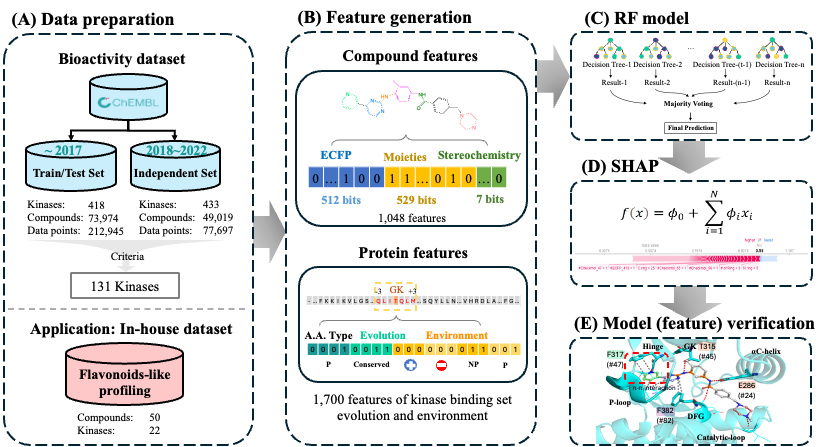

# Drug-Like Moieties and Binding-Site Evolution Enable Interpretable Kinase Inhibitor Prediction

This repository provides the datasets and source code associated with MoBEK, a kinase inhibitor prediction workflow that combines compound moiety descriptors with kinase binding-site evolution features.



**Overview of the MoBEK kinase inhibitor prediction framework.**

## Repository Structure

```text
.
├── README.md
├── overview.png
├── data/
│   ├── train.csv
│   ├── test.csv
│   ├── independent.csv
│   └── inhouse_50x22.csv
└── src/
    ├── generate_compound_features.py
    ├── generate_binding_site_features.py
    ├── merge_features.py
    ├── train_and_evaluate_random_forest.py
    ├── train_evaluate_and_interpret_mobek.py
    └── generate_feature/
        ├── protein/
        │   ├── Filter_BBA.csv
        │   └── KLIFS_85_feature_list.txt
        └── moieties/
            ├── checkmol
            ├── matchmol
            ├── mod_ac
            ├── inhouse/
            ├── pubchem/
            └── rings_in_drugs/
```

## Requirements

- Python 3
- NumPy
- pandas
- scikit-learn
- RDKit
- Matplotlib
- Seaborn
- IPython
- SHAP
- Git LFS

The bundled `checkmol`, `matchmol`, and `mod_ac` executables are Linux x86-64 binaries used by the compound-feature generator.

## Datasets

| File | Purpose | Records |
| --- | --- | ---: |
| `data/train.csv` | Model training set | 147,583 |
| `data/test.csv` | Held-out test set | 36,911 |
| `data/independent.csv` | Independent evaluation set | 57,383 |
| `data/inhouse_50x22.csv` | In-house evaluation set comprising 50 compounds across 22 kinases | 1,100 |

Each CSV contains 2,751 columns: `smiles`, `kinase`, `label`, compound descriptors, and kinase binding-site features. The four datasets use the same column names and order.

The CSV files are stored with Git Large File Storage. After cloning the repository, retrieve them with:

```bash
git lfs install
git lfs pull
```

## Source Code

### Feature generation

- `src/generate_compound_features.py` generates Checkmol, PubChem, in-house moiety, Rings in Drugs, ECFP, MACCS, and atom-count descriptors from SMILES.
- `src/generate_binding_site_features.py` generates kinase binding-site evolution features from `Filter_BBA.csv` using the KLIFS 85-position definitions.
- `src/merge_features.py` combines the generated Checkmol, PubChem, ring, atom-count, and ECFP tables and adds SMILES stereochemistry descriptors.

Compound-feature generation and binding-site feature generation are independent procedures. The released datasets already contain the combined model features, so feature generation is not required before running the model scripts.

### Model training, evaluation, and interpretation

- `src/train_and_evaluate_random_forest.py` trains a Random Forest classifier and evaluates it on the held-out test and independent datasets.
- `src/train_evaluate_and_interpret_mobek.py` contains the main MoBEK training, test, independent, in-house, feature-importance, and SHAP analysis workflow.

A pretrained model is not included. Each model script trains its own Random Forest classifier from `data/train.csv`.

## Usage

Run commands from the repository root unless otherwise noted.

### Generate compound features

Prepare an input directory containing `compound_list.txt` with one SMILES string per line:

```bash
python src/generate_compound_features.py -p path/to/input_directory
```

The default settings generate `checkmol.csv`, `pubchem.csv`, `ring.csv`, `ac.csv`, and `ecfp.csv` in the input directory. Use `-inhouse y` to additionally generate the optional in-house moiety representation.

### Merge compound features

Run the merge script from the directory containing `checkmol.csv`, `pubchem.csv`, `ring.csv`, `ac.csv`, and `ecfp.csv`:

```bash
cd path/to/feature_directory
python /path/to/MoBEK/src/merge_features.py
```

The output is written to `merge.csv` in the same directory.

### Generate binding-site features

```bash
python src/generate_binding_site_features.py
```

The script reads the bundled protein resources and writes `protein_features.csv` to the current directory.

### Train and evaluate the Random Forest model

```bash
python src/train_and_evaluate_random_forest.py
```

### Run the complete MoBEK analysis

```bash
python src/train_evaluate_and_interpret_mobek.py
```
